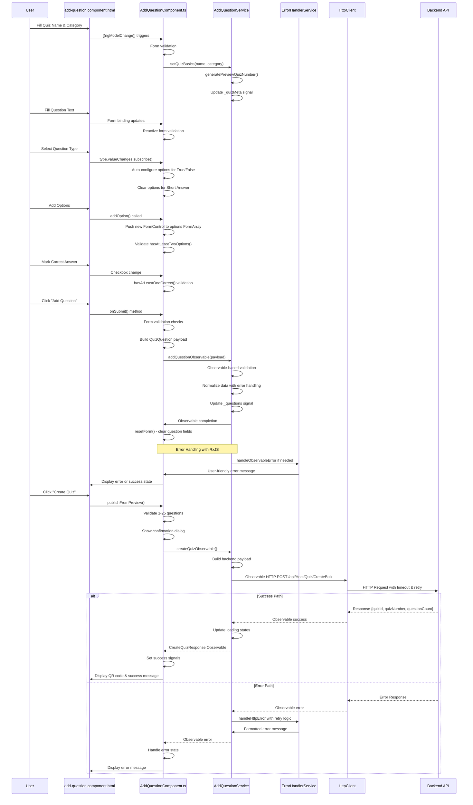
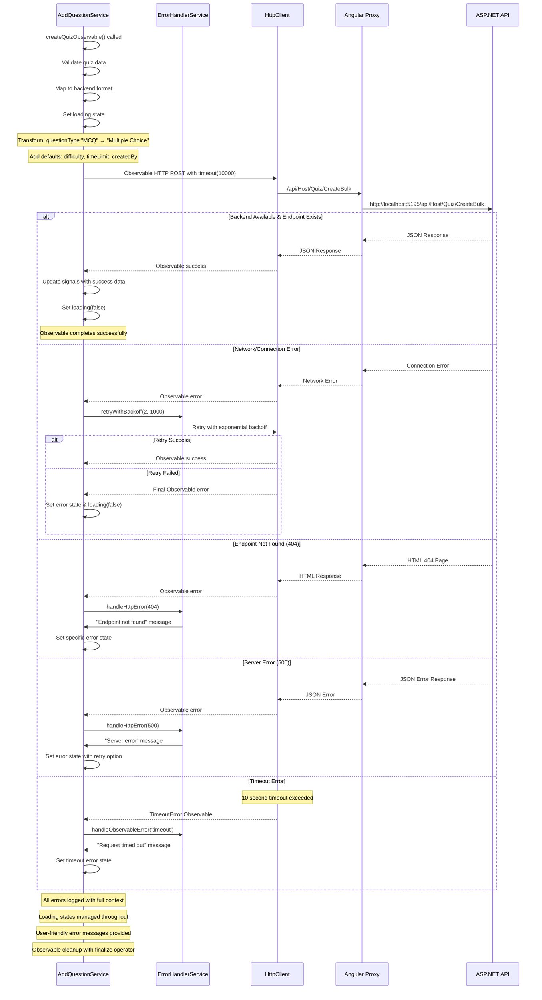
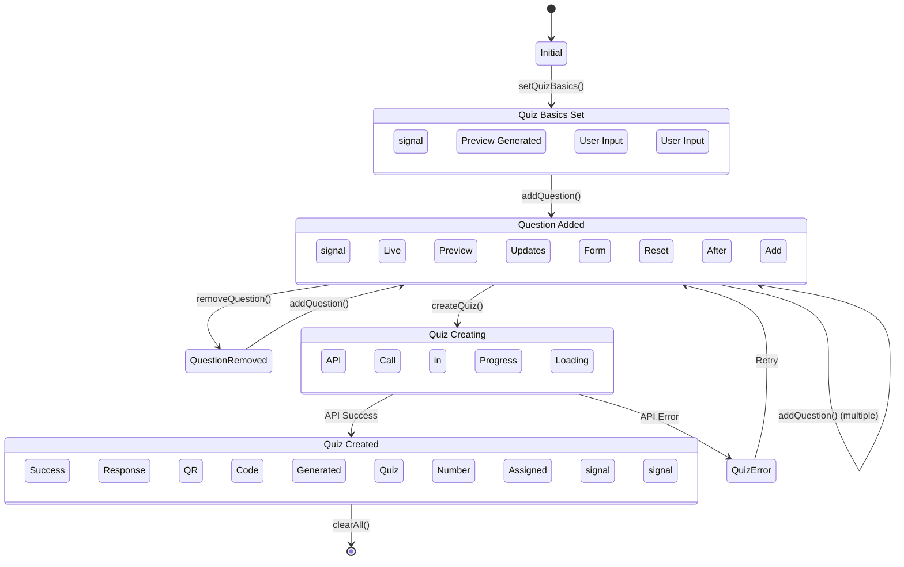

# Add Question Flow - Detailed Mermaid Diagrams

## 5. Complete Add Question Flow (HTML → TS → Service → API)



## 6. Form Validation & Method Flow

```mermaid
flowchart TD
    A[User Interaction] --> B{Form Event Type}

    B -->|Input Change| C[Reactive Form Binding]
    B -->|Type Selection| D[type.valueChanges]
    B -->|Add Option| E[addOption()]
    B -->|Remove Option| F[removeOption()]
    B -->|Submit Question| G[onSubmit()]
    B -->|Create Quiz| H[publishFromPreview()]

    C --> I[Form Validation]
    I --> J{Valid?}
    J -->|Yes| K[Enable UI Controls]
    J -->|No| L[Show Error States]

    D --> M[Question Type Logic]
    M --> N{Type Check}
    N -->|Multiple Choice| O[Ensure 2+ options]
    N -->|True/False| P[Auto-create True/False options]
    N -->|Short Answer| Q[Clear all options]

    E --> R[FormArray.push()]
    R --> S[Update Options Display]

    F --> T[FormArray.removeAt()]
    T --> U[Validate Remaining Options]

    G --> V[Validation Chain]
    V --> W[hasAtLeastTwoOptions()]
    W --> X[hasAtLeastOneCorrect()]
    X --> Y{All Valid?}
    Y -->|Yes| Z[Build QuizQuestion Payload]
    Y -->|No| AA[Show Validation Errors]

    Z --> BB[store.addQuestion()]
    BB --> CC[resetForm()]

    H --> DD[Final Validation]
    DD --> EE[Question Count Check]
    EE --> FF{1-25 Questions?}
    FF -->|Yes| GG[Confirmation Dialog]
    FF -->|No| HH[Show Error Message]

    GG --> II{User Confirms?}
    II -->|Yes| JJ[store.createQuiz()]
    II -->|No| KK[Cancel Operation]

    JJ --> LL[API Call Chain]
    LL --> MM[Success/Error Handling]

    style A fill:#ffeb3b
    style G fill:#4caf50
    style H fill:#2196f3
    style JJ fill:#ff5722
```

## 7. AddQuestionService Internal Flow

```mermaid
flowchart TD
    A[Service Methods] --> B{Method Called}

    B -->|setQuizBasics| C[setQuizBasics Flow]
    B -->|addQuestion| D[addQuestion Observable Flow]
    B -->|createQuiz| E[createQuiz Observable Flow]
    B -->|removeQuestion| F[removeQuestion Flow]
    B -->|CSV Import| G[CSV Import Observable Flow]

    C --> C1[Validate name & category]
    C1 --> C2[generatePreviewQuizNumber()]
    C2 --> C3[Update _quizMeta signal]
    C3 --> C4[Error handling with try/catch]

    D --> D1[Observable-based validation]
    D1 --> D2[setLoading(true)]
    D2 --> D3[Normalize payload data]
    D3 --> D4[Update _questions signal]
    D4 --> D5[Observable completion]
    D5 --> D6[setLoading(false)]
    D --> D7{Error Occurred?}
    D7 -->|Yes| D8[handleError() method]
    D7 -->|No| D9[Success Observable]

    E --> E1{Validation Check}
    E1 -->|Quiz meta missing| E2[Observable Error]
    E1 -->|No questions| E3[Observable Error]
    E1 -->|Wrong count| E4[Observable Error]
    E1 -->|Valid| E5[Map to Backend Format]

    E5 --> E6[Build API Payload]
    E6 --> E7[HTTP POST Observable with timeout]
    E7 --> E8{Observable Response}
    E8 -->|Success| E9[Return CreateQuizResponse Observable]
    E8 -->|Error| E10[RxJS Error Handling Pipeline]

    E10 --> E11[retryWithBackoff operator]
    E11 --> E12[catchError operator]
    E12 --> E13[finalize for cleanup]
    E13 --> E14[User-friendly error messages]

    F --> F1[Update _questions signal]
    F1 --> F2[Filter out removed question]

    G --> G1[File validation Observable]
    G1 --> G2[CSV parsing Observable]
    G2 --> G3[Question mapping Observable]
    G3 --> G4{Parsing Success?}
    G4 -->|Yes| G5[Update questions array]
    G4 -->|No| G6[Observable error with details]

    style E fill:#ff9800
    style E10 fill:#f44336
    style D8 fill:#ff5722
    style E11 fill:#2196f3
    style G1 fill:#4caf50
```

## 8. API Integration & Error Handling



## 9. Component State Management (Angular Signals)


