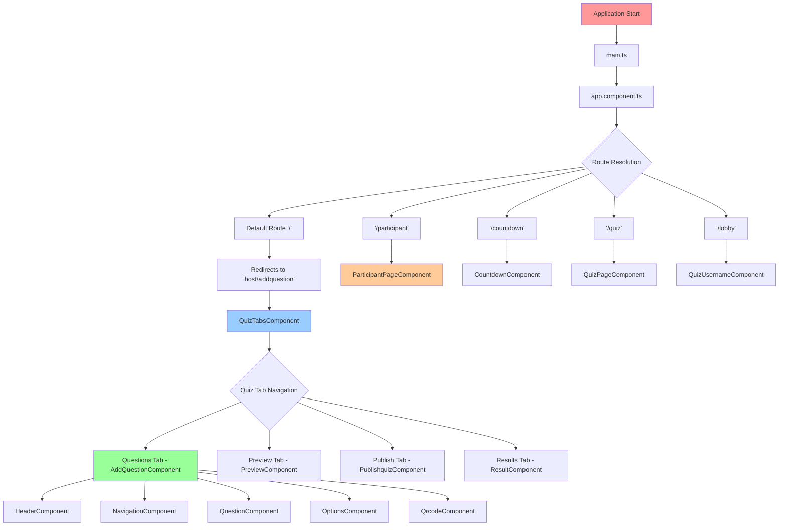
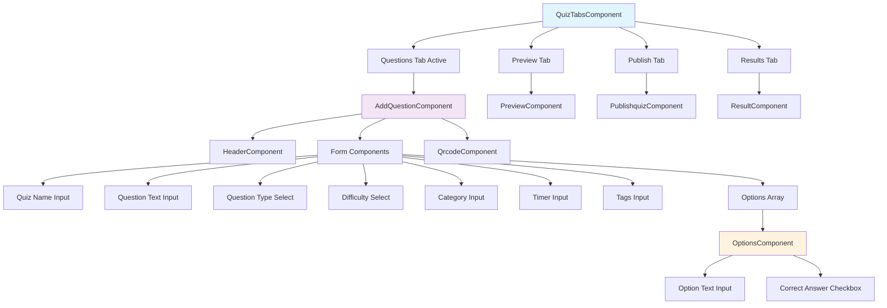
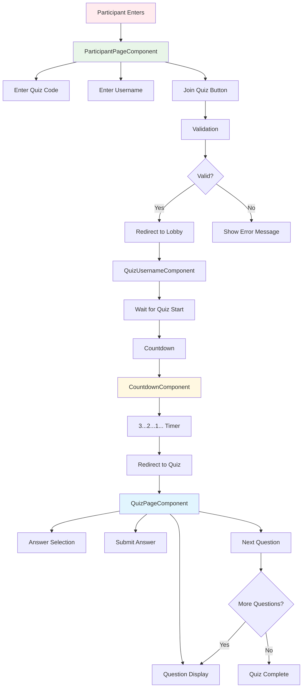

# CTS Quiz Application - Mermaid Diagrams

## 1. Application Startup & Navigation Flow



## 2. Quiz Host Flow - Component Hierarchy



## 3. Participant Flow



## 4. Service Layer Architecture with RxJS Error Handling

```mermaid
graph TD
    A[Angular Components] --> B[AddQuestionService]
    B --> C[HTTP Client with Observables]
    C --> D[Proxy Configuration]
    D --> E[Backend API Endpoints]

    B --> F[Signal-based State Management]
    F --> G[Quiz Meta Signal]
    F --> H[Questions Array Signal]
    F --> I[Loading State Signals]
    F --> J[Error State Signals]

    B --> K[Core Observable Methods]
    K --> L[setQuizBasics() with validation]
    K --> M[addQuestionObservable()]
    K --> N[createQuizObservable()]
    K --> O[removeQuestion() with state]
    K --> P[updateQuestion()]
    K --> Q[clearAll()]

    B --> R[API Integration with Error Handling]
    R --> S[createQuizObservable() - POST with retry]
    R --> T[getHostQuizzes() - GET with timeout]
    R --> U[getQuizForEdit() - GET with validation]
    R --> V[updateQuiz() - PUT with error recovery]
    R --> W[deleteQuiz() - DELETE with confirmation]
    R --> X[publishQuiz() - POST with loading states]

    B --> Y[Enhanced Utility Features]
    Y --> Z[CSV Import/Export with Observable validation]
    Y --> AA[Quiz Number Generation]
    Y --> BB[Observable Data Validation]
    Y --> CC[Form Validation Service Integration]

    %% Error Handling Integration
    B --> DD[ErrorHandlerService Integration]
    DD --> EE[centralized error processing]
    DD --> FF[retry logic with backoff]
    DD --> GG[user-friendly error messages]
    DD --> HH[loading state management]

    %% RxJS Operators Pipeline
    S --> II[Observable Pipeline]
    II --> JJ[timeout operator]
    II --> KK[retryWhen with backoff]
    II --> LL[catchError handler]
    II --> MM[finalize cleanup]

    style B fill:#e8f5e8
    style F fill:#fff3e0
    style K fill:#f3e5f5
    style R fill:#e1f5fe
    style DD fill:#ffebee
    style II fill:#f0f4c3
```
