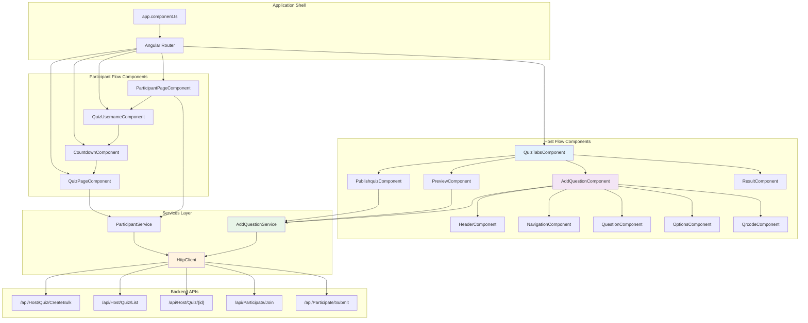
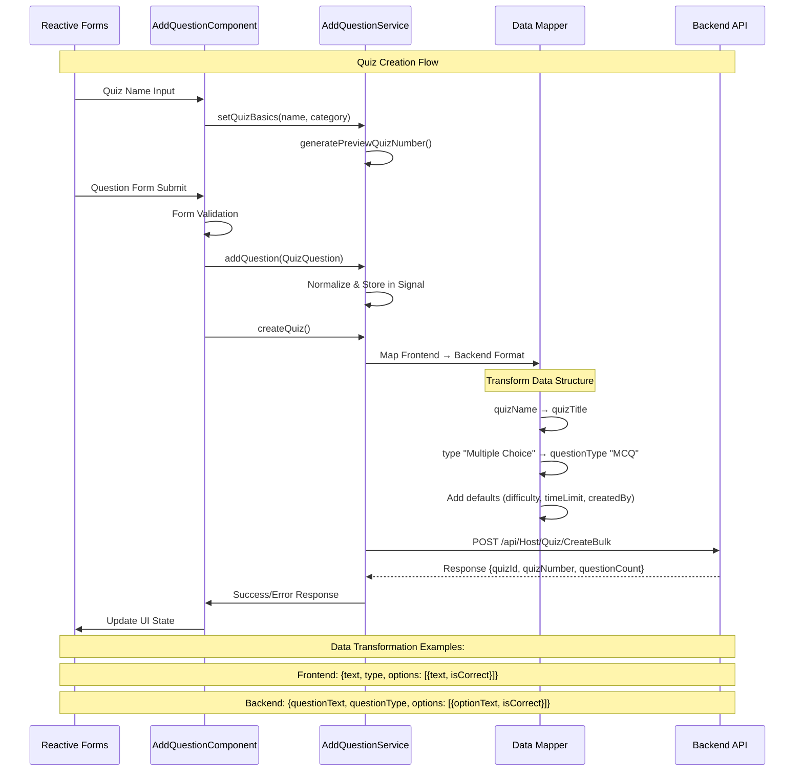
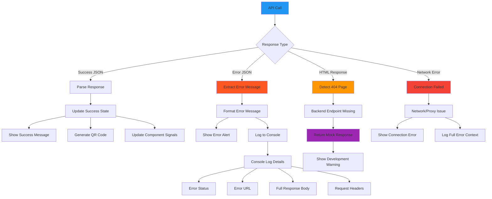

# Component Interactions & API Mapping

## 10. Complete Component Interaction Map



## 11. Method Mapping - Component to Service to API

```mermaid
flowchart LR
    subgraph "AddQuestionComponent Methods"
        CM1[setQuizName()]
        CM2[onSubmit()]
        CM3[addOption()]
        CM4[removeOption()]
        CM5[publishFromPreview()]
        CM6[deleteQuestion()]
        CM7[importCSV()]
        CM8[exportCSV()]
    end

    subgraph "AddQuestionService Methods"
        SM1[setQuizBasics()]
        SM2[addQuestion()]
        SM3[removeQuestion()]
        SM4[updateQuestion()]
        SM5[createQuiz()]
        SM6[getHostQuizzes()]
        SM7[getQuizForEdit()]
        SM8[updateQuiz()]
        SM9[deleteQuiz()]
        SM10[publishQuiz()]
        SM11[importFromCSV()]
        SM12[exportToCSV()]
    end

    subgraph "API Endpoints"
        API1[POST /api/Host/Quiz/CreateBulk]
        API2[GET /api/Host/Quiz/List]
        API3[GET /api/Host/Quiz/{id}]
        API4[PUT /api/Host/Quiz/{id}]
        API5[DELETE /api/Host/Quiz/{id}]
        API6[POST /api/Host/Quiz/{id}/Publish]
    end

    CM1 --> SM1
    CM2 --> SM2
    CM5 --> SM5
    CM6 --> SM3
    CM7 --> SM11
    CM8 --> SM12

    SM5 --> API1
    SM6 --> API2
    SM7 --> API3
    SM8 --> API4
    SM9 --> API5
    SM10 --> API6

    style CM5 fill:#ff5722
    style SM5 fill:#ff9800
    style API1 fill:#f44336
```

## 12. Data Flow - Forms to API Payload



## 13. Form Validation Chain

```mermaid
flowchart TD
    A[User Input] --> B[Reactive Form Validators]

    B --> C{Field Validation}
    C -->|Quiz Name| D[Validators.required]
    C -->|Category| E[Validators.required]
    C -->|Question Text| F[Validators.required, Validators.minLength(10)]
    C -->|Timer| G[Validators.min(0)]
    C -->|Options| H[Custom Validation Chain]

    H --> I[hasAtLeastTwoOptions()]
    I --> J{Type Check}
    J -->|Multiple Choice| K[≥ 2 options required]
    J -->|True/False| L[Exactly 2 options required]
    J -->|Short Answer| M[0 options allowed]

    H --> N[hasAtLeastOneCorrect()]
    N --> O[Check isCorrect flags]
    O --> P{At least one true?}
    P -->|Yes| Q[Valid]
    P -->|No| R[Invalid - Show Error]

    B --> S[Form State]
    S --> T{form.valid}
    T -->|True| U[Enable Submit Button]
    T -->|False| V[Disable Submit Button]
    T -->|False| W[Show Error Messages]

    style A fill:#e3f2fd
    style H fill:#fff3e0
    style T fill:#e8f5e8
```

## 14. Error Handling Flow



## 15. Signal-Based State Management

```mermaid
stateDiagram-v2
    [*] --> EmptyState

    state EmptyState {
        _quizMeta: null
        _questions: []
        isQuizCreated: false
        createdQuizNumber: ''
    }

    EmptyState --> BasicsFilled : setQuizBasics()

    state BasicsFilled {
        _quizMeta: {quizNumber, quizName, category}
        _questions: []
        Preview Quiz Number Generated
    }

    BasicsFilled --> QuestionsAdded : addQuestion()

    state QuestionsAdded {
        _questions: QuizQuestion[]
        Live Preview Updates
        Form Validation Active
    }

    QuestionsAdded --> QuestionsAdded : addQuestion()
    QuestionsAdded --> QuizPublished : createQuiz()
    QuestionsAdded --> EmptyState : clearAll()

    state QuizPublished {
        isQuizCreated: true
        createdQuizNumber: server assigned
        createdQuizId: server assigned
        QR Code Visible
    }

    QuizPublished --> EmptyState : clearAll()

    note right of QuestionsAdded
        Computed Properties:
        - canPublish()
        - questionCount()
        - disableAdd()
    end note
```
